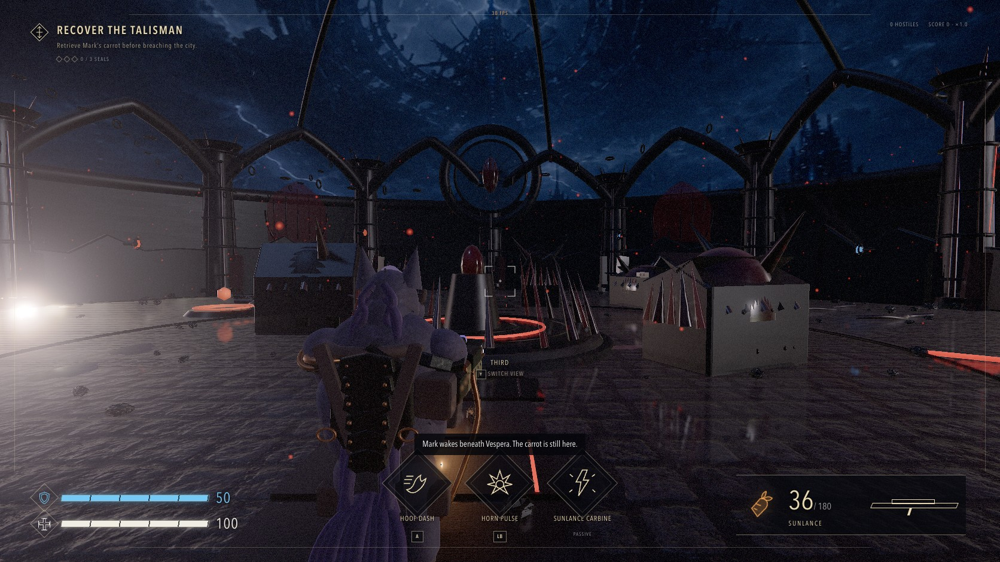

# Mark of the Veil

<p align="center">
  
</p>

<p align="center">
  A broken oath. A living world.
</p>

<p align="center">
  <a href="https://mark-of-the-veil.burry.io/"><strong>Play the game</strong></a>
  ·
  <a href="./docs/GAME_DESIGN.md">Game design</a>
  ·
  <a href="./docs/ARCHITECTURE.md">Architecture</a>
  ·
  <a href="./docs/RENDERING.md">Rendering</a>
</p>

<p align="center">
  <a href="https://github.com/Burry/mark-of-the-veil/actions/workflows/ci.yml"></a>
</p>

**Mark of the Veil** is a cinematic science-fantasy action game for desktop browsers. Play as Mark,
a battle-worn purple unicorn pilot, as he escapes a living alien city. The game is a replayable 10
to 15 minute mission with switchable first-person and third-person combat, three enemy classes, a
boss, upgrades, scoring, and a complete ending.



<p align="center"><sub>In-engine gameplay on the High render setting.</sub></p>

## The experiment

This project began as an experiment in one-shot vibecoding. I gave GPT-5.6 Sol Ultra, running in
Codex, one simple prompt and a concept image a friend had sent me. The goal was to see whether a
single build pass could produce a complete browser game instead of a mockup or isolated mechanic.

The first pass established the premise, playable mission, visual direction, and WebGL foundation.
Later agent passes refined the character materials, lighting, performance, accessibility, controls,
audio, tests, metadata, and deployment. One-shot describes the initial build constraint. The public
release includes that subsequent engineering and editorial work.

The original concept image is not included in this repository. Project-specific image plates and
material maps were generated and processed through the Codex workflow. The stone photoscan and HDR
environment are CC0 assets credited in [`THIRD_PARTY_NOTICES.md`](./THIRD_PARTY_NOTICES.md).

## Highlights

- Switch between first-person and third-person views at any time.
- Play with keyboard and mouse or a standard gamepad, with optional haptics.
- Fight through a complete mission with upgrades, a boss, ranks, and replay.
- Hear a procedural score, ambience, weapons, impacts, and spatial effects built with Web Audio.
- Tune quality, field of view, sensitivity, aim assist, captions, motion, flashes, camera shake, and
  audio buses.
- Install it as a standalone PWA. No account, backend, runtime API key, or asset CDN is required.

## Rendering

Moving gameplay uses a WebGL 2 hybrid renderer with physically based materials, HDR composition,
screen-space reflections, GTAO, soft shadows, bloom, antialiasing, and cinematic color grading.
Frozen high-quality scenes can progressively converge through a worker-backed four-bounce GPU path
tracer. The raster image remains available as a fallback, and moving combat is never labeled as
hardware ray tracing.

The renderer adapts its effects, light budget, and internal resolution when frame time rises. See
[`docs/RENDERING.md`](./docs/RENDERING.md) for the capability ladder, measured performance, and
path-tracing boundary.

## Run locally

Requires Node.js 22.13 or newer. Node.js 24 is used in CI.

```bash
npm ci
npm run dev
```

Open the local URL, choose **Begin Descent**, then click the game surface to capture the mouse.

## Controls

| Action             | Keyboard and mouse | Gamepad                 |
| ------------------ | ------------------ | ----------------------- |
| Move and look      | WASD and mouse     | Left stick, right stick |
| Fire and focus     | Left, right mouse  | RT, LT                  |
| Dash               | Space              | A / Cross               |
| Horn pulse         | Q                  | LB                      |
| Reload             | R                  | X / Square              |
| Interact           | E                  | X / Square              |
| Switch perspective | V                  | Y / Triangle            |
| Pause              | Escape             | Menu / Start            |

## Development

```bash
npx playwright install chromium
npm run check
npm run test:e2e
```

`npm run check` runs formatting, linting, type checks, unit tests, and a production build. The
Playwright suite serves the production output and verifies metadata, public assets, menus, WebGL
startup, and the core control path.

The main implementation boundaries are documented here:

- [`docs/ARCHITECTURE.md`](./docs/ARCHITECTURE.md): React, engine, simulation, input, and lifecycle
- [`docs/GAME_DESIGN.md`](./docs/GAME_DESIGN.md): mission, combat kit, enemies, upgrades, and scoring
- [`docs/DESIGN.md`](./docs/DESIGN.md): visual system, accessibility, and asset inventory
- [`docs/RENDERING.md`](./docs/RENDERING.md): rendering tiers, path tracing, budgets, and fallbacks

## Deploy

Import the repository into Vercel. The included [`vercel.json`](./vercel.json) builds the Vite app
and serves `dist/` with production caching and security headers. No environment variables are
required.

## License and credits

The project code and original assets are available under the [MIT License](./LICENSE). Third-party
software and CC0 asset credits are listed in
[`THIRD_PARTY_NOTICES.md`](./THIRD_PARTY_NOTICES.md).

<details>
<summary>Narrative ending: spoiler</summary>

After defeating the Hollow Regent, Mark infiltrates the Root Choir and receives the alien
hive-mind's total knowledge. He searches that knowledge for his origin, discovers that unicorns
were never real, and loses the boundary between himself and everything known. Mark ceases to exist.
The Choir remembers the impossible unicorn who entered it.

</details>
