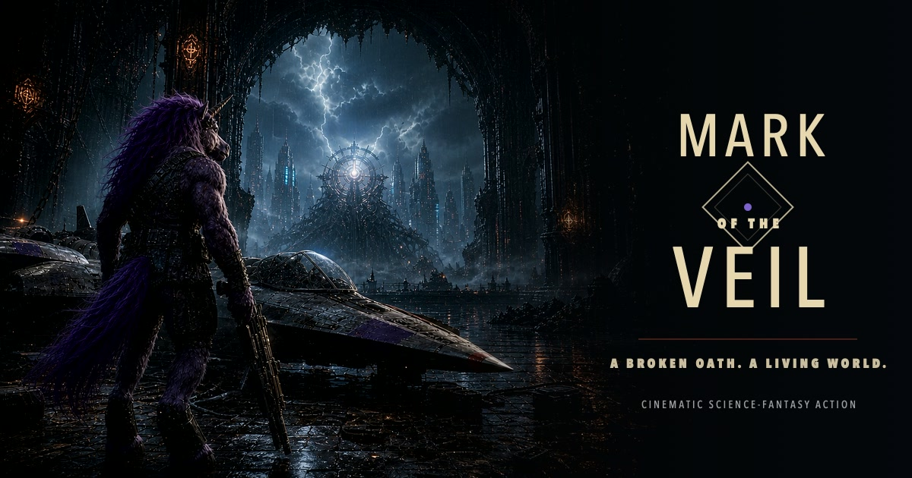
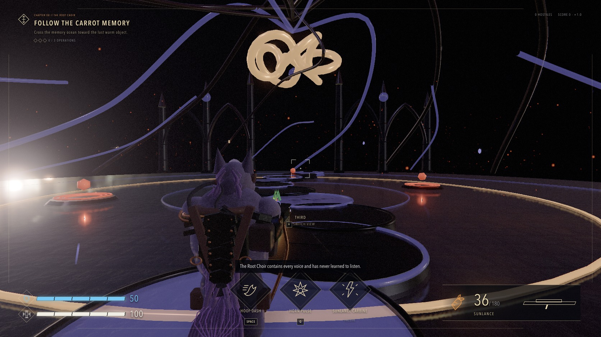
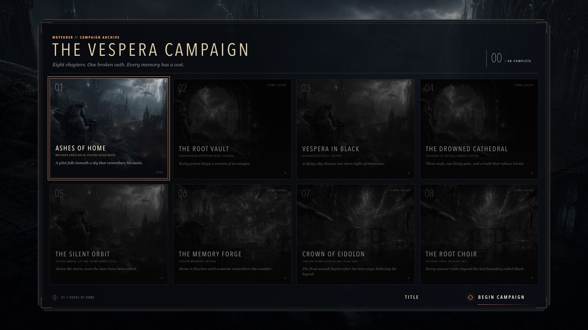

# Mark of the Veil

<p align="center">
  
</p>

<p align="center">
  A broken oath. A living world.
</p>

<p align="center">
  <a href="https://mark-of-the-veil.burry.io/"><strong>Play the game</strong></a>
  ·
  <a href="./docs/GAME_DESIGN.md">Game design</a>
  ·
  <a href="./docs/ARCHITECTURE.md">Architecture</a>
  ·
  <a href="./docs/RENDERING.md">Rendering</a>
</p>

<p align="center">
  <a href="https://github.com/Burry/mark-of-the-veil/actions/workflows/ci.yml"></a>
</p>

**Mark of the Veil** is an eight-chapter science-fantasy action campaign for desktop browsers.
Play as Mark, a battle-worn purple unicorn pilot, across Vespera, the Eidolon Crown, and the alien
Root Choir. Combat supports instant first-person and third-person switching, keyboard and mouse,
standard gamepads, optional haptics, spatial sound, and an adaptive procedural score.

The campaign contains eight compact combat levels. It is not an open world. Each chapter loads a
distinct arena layout, hero scenery, color and lighting profile, weather or particle treatment,
authored recovery prop, encounter script, boss silhouette, and music profile. Shared systems keep the
download and GPU workload practical for a browser.



<p align="center"><sub>In-engine gameplay on the High render setting.</sub></p>

## Campaign



<p align="center"><sub>In-game campaign map. Chapters unlock in narrative order.</sub></p>

| Chapter | Location                  | Runtime identity                                |
| ------: | ------------------------- | ----------------------------------------------- |
|      01 | **Ashes of Home**         | Wayfarer crash basin and stormglass observatory |
|      02 | **The Root Vault**        | Bio-gothic prison and fungal aqueduct           |
|      03 | **Vespera in Black**      | Rain-soaked relay rooftops                      |
|      04 | **The Drowned Cathedral** | Flooded nave and three Veil seals               |
|      05 | **The Silent Orbit**      | Orbital lift, rings, and drifting debris        |
|      06 | **The Memory Forge**      | Fractured archive and rotating memory engine    |
|      07 | **Crown of Eidolon**      | Conduit trenches and living gate                |
|      08 | **The Root Choir**        | Memory causeway and neural convergence          |

Every chapter follows a focused action spine: recover its physical story prop, cross three objective
sites, clear their combat encounters, choose a relic, defeat the chapter boss, and extract. Briefings
and in-game transmissions carry one continuous three-act story through the final revelation.

Campaign progress is stored locally when a chapter is completed and when the next chapter begins.
Reloading resumes from the current chapter boundary. The codebase contains typed checkpoint
definitions for future expansion, but the shipped game does not resume from a mid-chapter
checkpoint.

## The experiment

This project began as an experiment in one-shot vibecoding. I gave GPT-5.6 Sol Ultra, running in
Codex, one simple prompt and a concept image a friend had sent me. The goal was to see whether a
single build pass could produce a complete browser game instead of a mockup or isolated mechanic.

The first pass established the premise, playable mission, visual direction, and WebGL foundation.
Later agent passes expanded it into an eight-chapter campaign and refined the character materials,
lighting, audio, performance, accessibility, controls, tests, metadata, documentation, and
deployment. One-shot describes the initial build constraint. The public release includes that
subsequent production and editorial work.

My friend approved publication of his supplied assets. The original concept image remains excluded
from this repository. Shipped image plates and material studies were generated and processed through
the Codex workflow. The stone photoscan and HDR environment are CC0 assets credited in
[`THIRD_PARTY_NOTICES.md`](./THIRD_PARTY_NOTICES.md).

## Highlights

- Eight selectable chapters with ordered unlocks, chapter briefings, completion screens, and a
  complete ending.
- Instant first-person and third-person combat using one authoritative player pose and aim ray.
- Three regular enemy archetypes, chapter-specific encounter waves, and arena collision constraints
  for both Mark and enemies.
- Eight procedural boss silhouette and animation kits over one shared Regent behavior family.
- Keyboard and mouse plus standard gamepad controls, optional haptics, and device-aware prompts.
- Eight procedural Web Audio profiles with distinct tempo, meter, harmony, motif, ambience, and
  combat intensity.
- Quality, field of view, sensitivity, aim assist, captions, motion, flashes, camera shake, haptics,
  and separate audio bus settings.
- Standalone PWA installation with no account, backend, runtime API key, or asset CDN.

## Browser rendering scope

Moving gameplay uses WebGL 2 with physically based materials, HDR composition, screen-space
effects, soft shadows, bloom, antialiasing, and cinematic color grading. High-quality frozen scenes
can use an optional progressive path-tracing presentation when the browser and GPU support it.
Combat is rasterized WebGL and does not use hardware ray tracing.

The renderer adapts effects, forward lights, and internal resolution when frame time rises. See
[`docs/RENDERING.md`](./docs/RENDERING.md) for the capability ladder and measured performance.

## Run locally

Requires Node.js 22.13 or newer. Node.js 24 is used in CI.

```bash
npm ci
npm run dev
```

Open the local URL, choose **Begin Campaign**, select **Ashes of Home**, then click the game surface
to capture the mouse.

## Controls

| Action             | Keyboard and mouse | Gamepad                 |
| ------------------ | ------------------ | ----------------------- |
| Move and look      | WASD and mouse     | Left stick, right stick |
| Fire and focus     | Left, right mouse  | RT, LT                  |
| Dash               | Space              | A / Cross               |
| Horn pulse         | Q                  | LB                      |
| Reload             | R                  | X / Square              |
| Interact           | E                  | X / Square              |
| Switch perspective | V                  | Y / Triangle            |
| Pause              | Escape             | Menu / Start            |

## Development

```bash
npx playwright install chromium
npm run check
npm run test:e2e
```

`npm run check` runs formatting, linting, type checks, unit tests, and a production build. Playwright
serves the production output and verifies metadata, public assets, menus, WebGL startup, and the core
control path.

- [`docs/ARCHITECTURE.md`](./docs/ARCHITECTURE.md): campaign state, React, runtime, rendering, audio,
  input, persistence, and lifecycle
- [`docs/GAME_DESIGN.md`](./docs/GAME_DESIGN.md): story arc, levels, combat, encounters, scoring, and
  shipped boundaries
- [`docs/DESIGN.md`](./docs/DESIGN.md): visual system, chapter profiles, accessibility, and assets
- [`docs/CAMPAIGN.md`](./docs/CAMPAIGN.md): long-form narrative and future production bible
- [`docs/WORLD_AUDIO_BIBLE.md`](./docs/WORLD_AUDIO_BIBLE.md): art, cinematography, sound, and music
  direction, including targets beyond the current runtime
- [`docs/RENDERING.md`](./docs/RENDERING.md): rendering tiers, budgets, progressive presentation, and
  fallbacks

## Deploy

Import the repository into Vercel. [`vercel.json`](./vercel.json) builds the Vite app and serves
`dist/` with production caching and security headers. No environment variables are required.

## License and credits

Project code and original assets are available under the [MIT License](./LICENSE). Third-party
software and CC0 asset credits are listed in
[`THIRD_PARTY_NOTICES.md`](./THIRD_PARTY_NOTICES.md).

<details>
<summary>Narrative ending: spoiler</summary>

After entering the Root Choir, Mark receives the alien hive-mind's total knowledge. He searches it
for his origin and discovers that unicorns never existed. With no boundary left between the knower
and everything known, Mark ceases to exist. The Choir remembers the impossible unicorn who entered
it.

</details>
